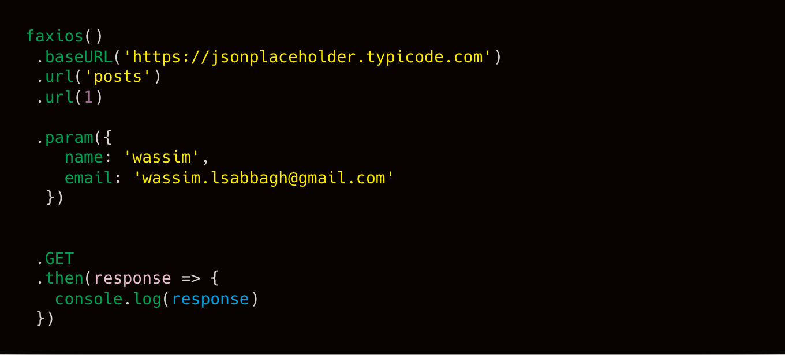

<!-- # Faxios -->

<!-- [](https://www.npmjs.org/package/faxios)
[](http://npm-stat.com/charts.html?package=faxios)
[](https://gitter.im/lsabbagh/faxios) -->

Simple and advanced HTTP client for the browser and node.js

<!---!--->


### url

```js
faxios()
  .url('http://jsonplaceholder.typicode.com/posts/1/comment')


  // smart joining url
  .url('http://jsonplaceholder.typicode.com/','posts',1,'comment')


  // replacing object keys by values
  .url('http://jsonplaceholder.typicode.com/posts/:id/comment')
  .url({':id': 1})


  // appending url, useful with builders
  .url('http://jsonplaceholder.typicode.com')
  .url('posts')
  .url(1)
  .url('comment')

  .GET // -> Promise
  .then(res => {})
  .catch(err => {});
```

### baseURL
```js
faxios()
  .baseURL('http://jsonplaceholder.typicode.com')
  .url('/posts/1/comments')

  .GET // -> Promise
  .then(res => {})
  .catch(err => {});
```

### header
```js
  faxios()
  .baseURL('http://jsonplaceholder.typicode.com')
  .url('posts')
  .param('postId', 1)
  .header('Authorization', 'your_token')

  .GET // => Promise
  .then(res => {})
  .catch(err => {});
```


### param
```js
faxios()
.baseURL('http://placeholder.typicode.com')
.url('posts')
.param('postId', 1)
.param({
  key1: 'value1',
  key2: 'value2',
  key3: 'value3'
})
.param(URLSearchParams) // use URLSearchParams instance instead of plain object

.GET // -> Promise
.then(res => {})
.catch(err => {});
```

### data
```js
    faxios()
    .baseURL('http://jsonplaceholder.typicode.com')
    .url('/posts')
    .param('postId', 1)

    .data(FormData) // <--- notice this...

    .data('key0', 'value0')
    .data({
      key1: 'value1',
      key2: 'value2',
      key3: 'value3'
    })
    .data({
      key4: 'value4',
    })
    .data('key5', 'value5')

    .data('hello', [1,2,3]) // hello[] = 1, hello[] = 2, hello[]=3

    .POST // => Promise
    .then(res => {})
    .catch(err => {});
  ```

### method
```js
faxios()
.baseURL('http://jsonplaceholder.typicode.com')
.url('posts', 1, 'comments')

// get, post, put, delete, head, options, patch, fetch, request
.method('get')

.FETCH // => Promise
.then(res => {})
.catch(err => {});
```

### cancel
```js
  // building..
let req = faxios()
  .baseURL('http://jsonplaceholder.typicode.com')
  .url('posts', 1, 'comments')

  // fetching..
  req // =>
  .FETCH // => Promise
  .then(res => {})
  .catch(err => {});

  // canceling...
  req.cancel();
```

### delay
```js

faxios()
.baseURL('http://jsonplaceholder.typicode.com')
.url('posts', 1, 'comments')

.delay(1 * 1000) // delay sending the request 1000 ms

.FETCH // => Promise
.then(res => {})
.catch(err => {});
```

### debounce
```js

let fetcher = faxios()
.baseURL('http://jsonplaceholder.typicode.com')
.url('posts', 1, 'comments')

.debounce(1 * 1000) // debounce time 1000ms


fetcher
.FETCH // => Promise
.then(res => console.log('res1:',res))
.catch(err => console.log('error1:', err));

fetcher
.FETCH // => Promise
.then(res => console.log('res2:', res))
.catch(err => console.log('error2:', err));

fetcher
.FETCH // => Promise
.then(res => console.log('res3:',res))
.catch(err => console.log('error3:', err));

fetcher
.FETCH // => Promise
.then(res => console.log('res4:', res))
.catch(err => console.log('error4:', err));


/**

error1:debounced

error2:debounced

error3:debounced

res4:{...}

**/
```

### alias

```js
faxios()
.baseURL('http://jsonplaceholder.typicode.com')
.alias('param', 'id', 'postId') // <-- setting the alias
.id(1)

.FETCH // => Promise
.then(res => {})
.catch(err => {});
  ```

### build
  ```js
  let base_builder = fax => fax
  .baseURL('http://jsonplaceholder.typicode.com')
  .header('Content-Type', 'text/html');

  faxios()
  .build(base_builder)
  .url('/posts')

  .FETCH // => Promise
  .then(res => {})
  .catch(err => {})
```

### builders.add build
```js
  faxios.builders.add('buider_name', fax => fax
    .baseURL('http://jsonplaceholder.typicode.com')
    .header('Content-Type', 'text/html')
  );

  faxios()
  .build('builder_name')
  .url('/posts')

  .FETCH // => Promise
  .then(res => {})
  .catch(err => {});
```

### listeners
```js
    let l = console.log

    faxios()
    .build(base)
    .postId(1)
    .data('key1', 'value1')

    .onBefore(config => {/* do stuff..*/}) // before sending
    .onSuccess(config => {/* do stuff..*/}) // on 200, 201, ..... etc
    .onError(config => {/* do stuff..*/}) // only on error
    .onComplete(config => {/* do stuff..*/}) // after finishing the request
    .onChange(config => {/* do stuff..*/}) // before and after finishing the request

    .onInformational((config) => {/* do stuff..*/}) //status matches 1[0-9][0-9]
    .onSuccess((config) => {/* do stuff..*/}) // status matches 2[0-9][0-9]
    .onRedirectional((config) =>  {/* do stuff..*/}) // status matches 5[0-9][0-9]
    .onClientError((config) =>  {/* do stuff..*/}) // status matches 4[0-9][0-9]
    .onServerError((config) => {/* do stuff..*/}) //status matches 5[0-9][0-9]

    .onBadRequest((config) => {/* do stuff..*/}) // status equal to 400
    .onUnauthorized((config) => {/* do stuff..*/}) // status equal to 401
    .onForbidden((config) => {/* do stuff..*/})  // status equal to 403 
    .onNotFound((config) => {/* do stuff..*/})  // status equal to 404 
    .onInternalServerError((config) => {/* do stuff..*/}) // status equal to 500
    .onBadGateway((config) => {/* do stuff..*/}) // status equal to 502
    .onServiceUnavailable((config) => {/* do stuff..*/}) // status equal to 503
    .onGatewayTimeout((config) => {/* do stuff..*/}) // status equal to 504

     // or
    .on('success', () => {/* do stuff..*/})
    .on('Bad Request', () => {/* do stuff...*/})
    .on('*status name here, check http statueses*', () => {/* do stuff...*/})

    // regex
    .on(200, () => console.log('on response status is 200'))
    .on(404,  () => console.log('on response status is 404'))
    .on(/200|400/, () => console.log('on status 200 or 400'))
    .on(new RegExp('200|400'), () => console.log('on status 200 or 400'))
    .on('2.*', () => console.log('on response status matches the regex 2.*'))


    .FETCH
    .then(res => {})
    .catch(err => {})
```
