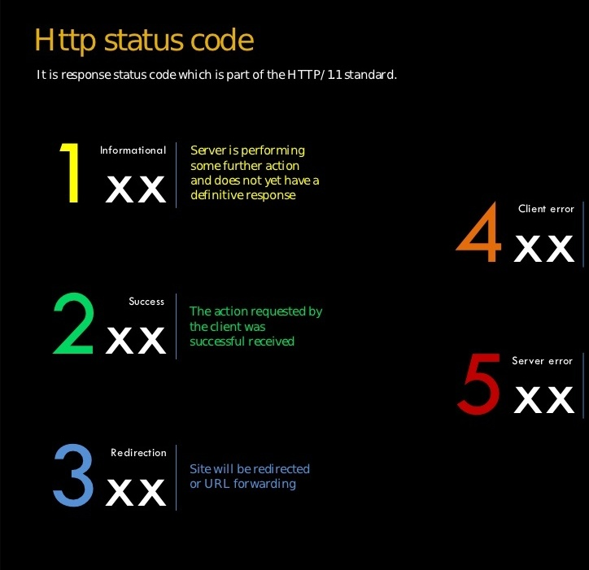

# Faxios

[](https://www.npmjs.org/package/faxios)
[](http://npm-stat.com/charts.html?package=faxios)
[](https://gitter.im/lsabbagh/faxios)

Method chaining and Promise based HTTP client for the browser and node.js that is build totally on top of axios.


## Example

```js
faxios()
 .get('https://jsonplaceholder.typicode.com/posts/1/comments')
  .then(res => {})
  .catch(err => {})
```

`baseURL`

```js
faxios()
  .baseURL('http://jsonplaceholder.typicode.com')
  .get('/posts/1/comments') // => Promise

  .then(res => {})
  .catch(err => {})
```

`url`

```js
faxios()
  .baseURL('http://jsonplaceholder.typicode.com')
  .url('posts/1/comments' )
  // or .url('posts', 1, 'comments')
  .get() // => Promise

  .then(res => {})
  .catch(err => {})


```

`method`

```js
faxios()
  .baseURL('http://jsonplaceholder.typicode.com')
  .url('posts', 1, 'comments')
  .method('get')
  .request() // => Promise

  .then(res => {})
  .catch(err => {})
```


`param`

```js
faxios()
  .baseURL('http://placeholder.typicode.com')
  .url('posts')
  .method('get')
  .param('postId', 1)
  .request() // => Promise

  .then(res => {})
  .catch(err => {})
```

`header`

```js
faxios()
  .baseURL('http://jsonplaceholder.typicode.com')
  .url('posts')
  .method('get')
  .param('postId', 1)
  .header('Authorization', 'your_token')
  .request() // => Promise

  .then(res => {})
  .catch(err => {})
```


`data`

```js
faxios()
  .baseURL('http://jsonplaceholder.typicode.com')
  .url('/posts')
  .method('post')
  .header('Authorization', 'your_token')
  .param('postId', 1)
  .data('key', 'value')  // could be any key or value
  .request() // => Promise

  .then(res => {})
  .catch(err => {})
```

`alias`

```js
faxios()
  .baseURL('http://jsonplaceholder.typicode.com')
  .alias('param', 'postId') // <-- setting the alias
  .postId(1)
  .request() // => Promise

  .then(res => {})
  .catch(err => {})
```

`use`

```js
// base middleware
let base = fax => fax
  .baseURL('http://jsonplaceholder.typicode.com')
  .header('Content-Type', 'text/html')

faxios()
  .use(base)
  .url('/posts')
  .request() // => Promise

  .then(res => {})
  .catch(err => {})
```

`middleware`

```js
// saving the middleware in faxios,
// notice it's not saved in an instance
faxios.middleware('base', base)

faxios()
  .use('base') // name of the saved middleware
  .use(posts) // reference to the middleware
  .postId(1)
  .data('key1', 'value1')

  .change(config => console.log(config))

  .request() // => Promise
  .then(res => {})
  .catch(err => {})
```


`listeners`



```js
faxios()
  .use(base)
  .postId(1)
  .data('key1', 'value1')

  .before(config => console.log('before sending', config))
  .success(config => console.log('only on success', config)) //200
  .error(config => console.log('only on error ', config))
  .complete(config => console.log('on success and error', config))
  .change(config => console.log('before and complete', config))

  // or...
  .on('before', ()=> console.log('on before', config)) //before the reques
  .on('success', ()=> console.log('only on success', config)) // on(200, ...)
  .on('error', ()=> console.log('only on error', config)) // on(state != 200, ...)
  .on('complete', ()=> console.log('on success and error', config)) 
  .on('change', ()=> console.log('on before and complete', config))
  
  .onInformational(() => console.log('onInformational, response status matches 1[0-9][0-9]'))
  .onSuccess(() => console.log('onSuccess, response status matches 2[0-9][0-9]'))
  .onRedirectional(() => console.log('onRedirectional, response status matches 5[0-9][0-9]'))
  .onClientError(() => console.log('onClientError, response status matches 4[0-9][0-9]'))
  .onServerError(() => console.log('onServerError, response status matches 5[0-9][0-9]'))

   // regex
  .on(200, () => console.log('on response status is 200'))
  .on(404,  () => console.log('on response status is 404'))
  .on(/200|400/, () => console.log('on status 200 or 400'))
  .on(new RegExp('200|400'), () => console.log('on status 200 or 400'))
  .on('2.*', () => console.log('on response status matches the regex 2.*'))


  .request() // => Promise
  .then(res => {})
  .catch(err => {})
```

`loading`
```js

faxios()
  .use(base)
  .key('getting_posts')
  .set('param', 'postId', 1) // --> param('postId', 1)
  .request() // => Promise

faxios.loading('getting_posts') // => true
// after two seconds
faxios.loading('getting_posts') // => false
```